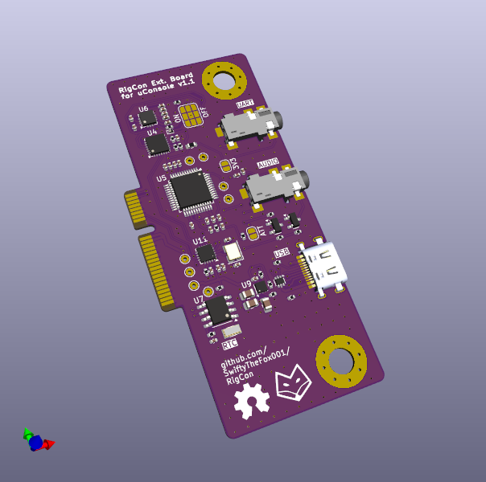

# RigCon
Extension Board for the ClockworkPI uConsole to connect ham radio equiptment

## Features
- Rig Interface similar to DigiRig
    - Audio interface
    - UART interface
    - PTT
- Additional external USB Port (500mA max)
- RTC

## Production

### JLC PCB
The main PCB can be ordered nearly assembled via JLC PCB.
- PCB settings:
 - Load .zip file from the "Production" folder
 - PCB Thickness: 1mm
 - Surface Finish: ENIG (recommended because of the edge connector)
- Assembly:
 - use bom_JLC.csv and positions_JLC.csv from the  "Production" folder
 - Check rotation of chips THRICE! Rotate them so, that the pink dot is alligned with the white arrows.

### DigiKey
The battery clip, the two jacks and the USB port were ordered seperately from Digikey. See "Production/bom_complete.csv" for the product names or check in KiCAD directly.

These parts need to be soldered manually. Drop a bit of solder on the GND pin of the bettery clip to ensure that the pad is contacted properly.
 
## Setup the RTC
Follow the tutorial here: https://learn.adafruit.com/adding-a-real-time-clock-to-raspberry-pi/set-up-and-test-i2c
The used RTC is a pcf8523!

## Version History
### v1.1
Fixes of v1.0 applied to schematic, not re-ordered YET

Changes from RigCon version 1.0 to 1.1:
- changed clock crystal footprint
- removed I2C pullup resistor footprints (was DNP before)
- removed unneccessary load caps for clock crystal (RTC has internal ones)
- changed cap value on CM108B pin 37 to 10uF (NECESSARY!)
- removed GND connectrio on CM108B pin 16 SDIN (optional, simplified)

Added directory FrontPanel/ with dxf, openSCAD and stl files
Added Schematic to main dir
Added Render Pic of PCB to main dir

### v1.0
First ordered version.

## This work is based on other projects!
[DigiRig-mobile](https://github.com/softcomplex/Digirig-Mobile) ([v1.9](https://github.com/softcomplex/Digirig-Mobile/tree/6721ff3781d7879b822c3f6550d4fcae7a4c0a2a)) (GNU GPL v3)
To provide an audio, ptt and uart interface for digital modes for ham radio. The CM108 was replaced with an CM108B and the 2-port USB controller was replaced with a 4-port USB controller to accomodate the additional external USB Port. The pinout of the audio jacks, solder pads for configuration and test pins were reused 1:1 to allow an easy reuse of exisiting peripherals and support for a wide range of transceivers.

[uconsole-expansion-card-template-kicad](https://github.com/PotatoMania/uconsole-expansion-card-template-kicad) ([used Version](https://github.com/PotatoMania/uconsole-expansion-card-template-kicad/tree/a174627fb24a4a155137b862d881c7e6f08ff017)) (CC BY-SA 4.0) 
PCB Outline, speakers, M.2 connector and mounting hole placements. I Changed to shape of mounting holes and the speaker pads, but all measurements provided by the original were correct.

